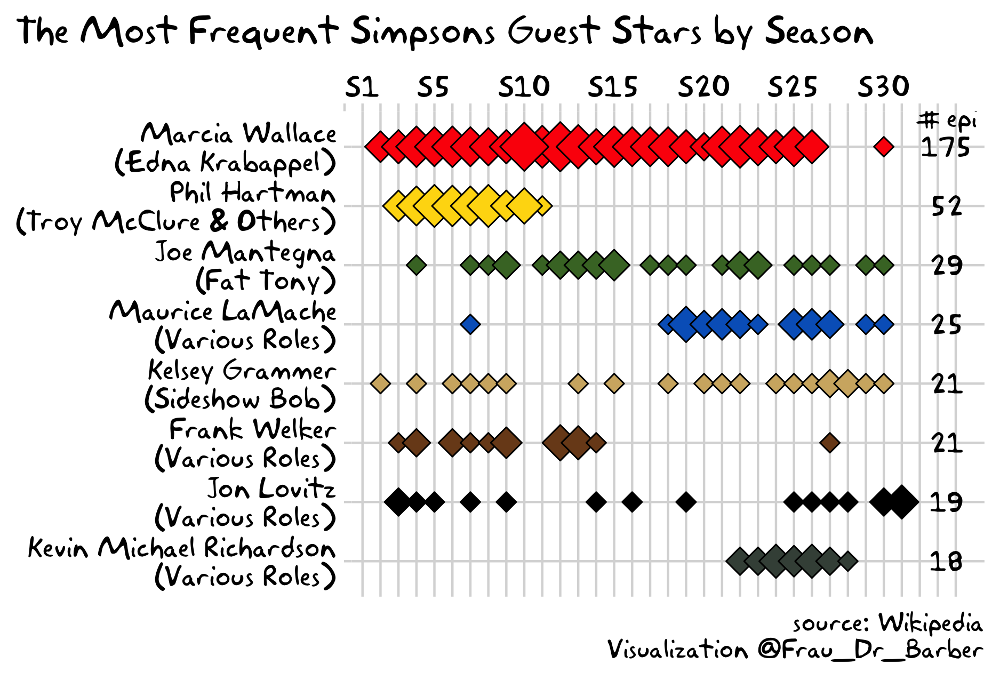
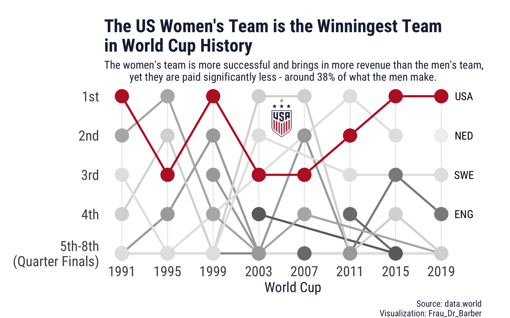
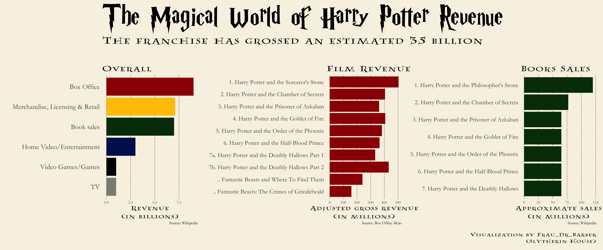
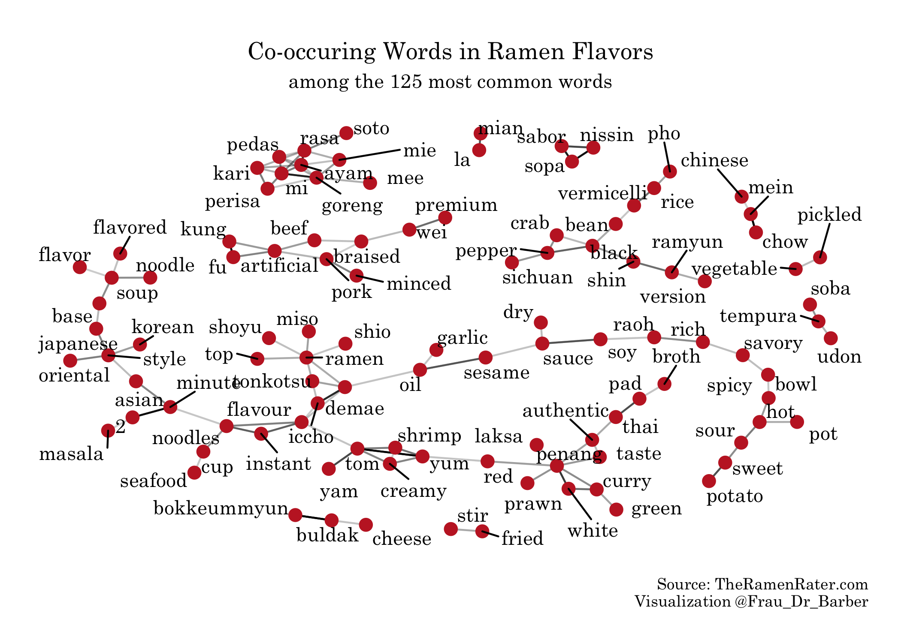
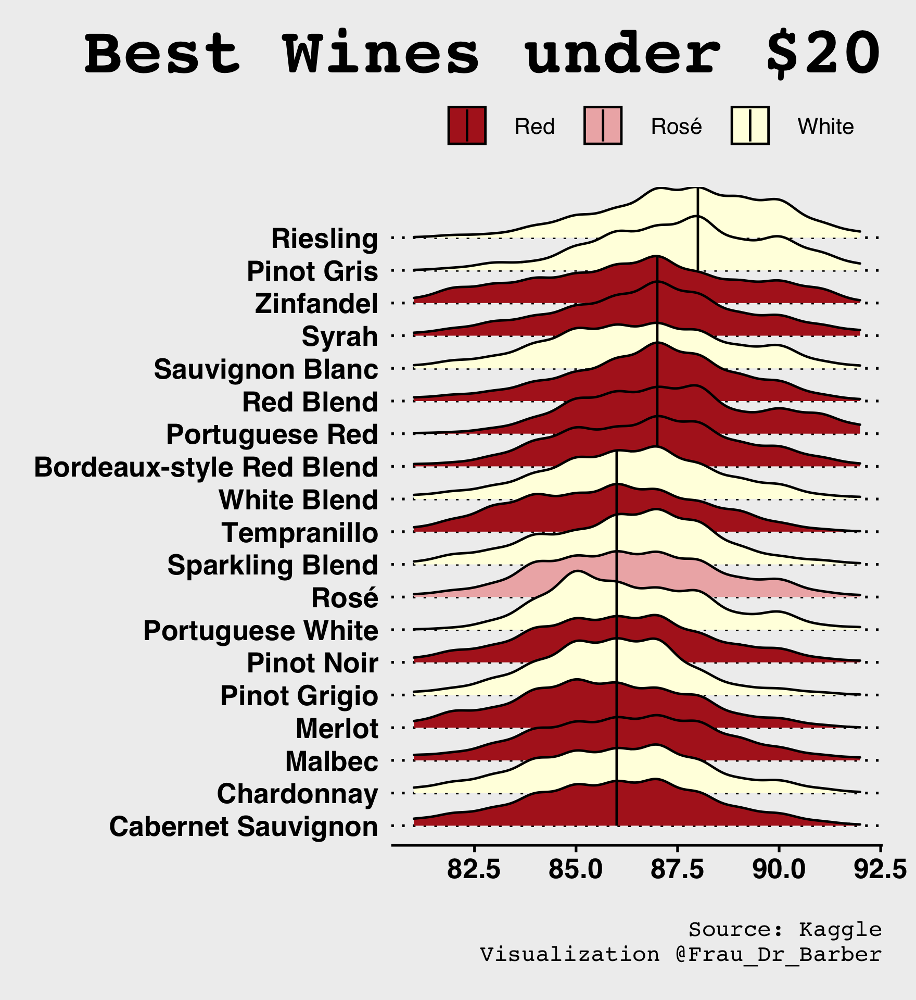
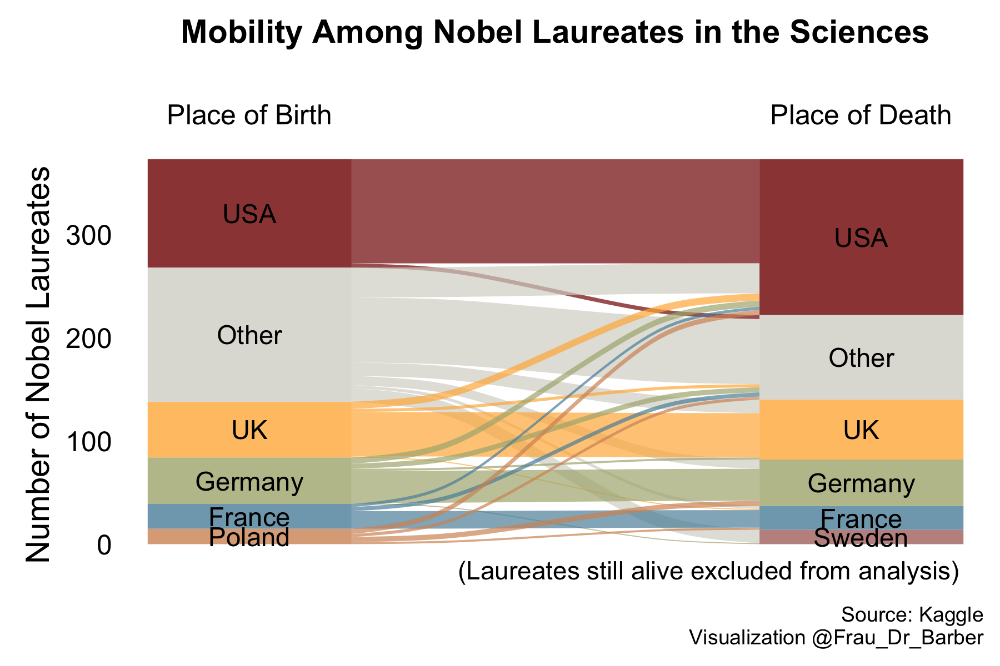
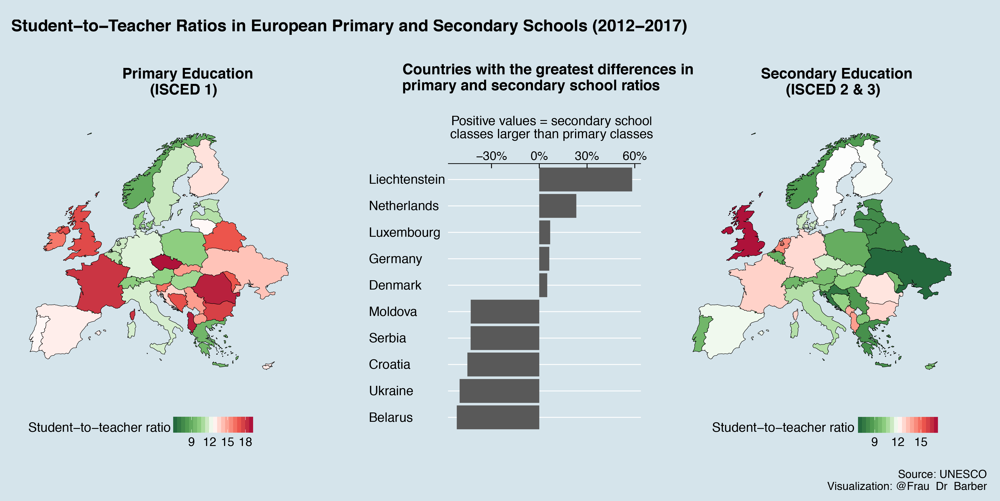
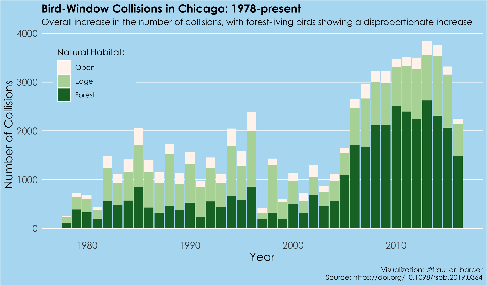
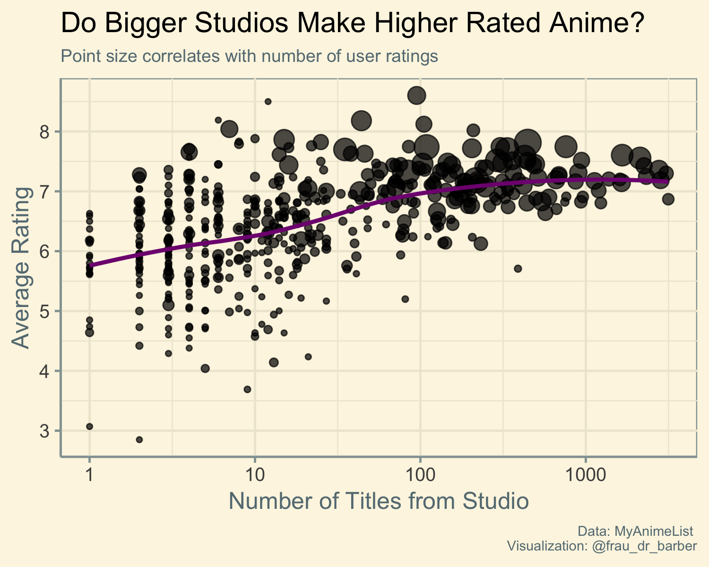

## Tidy Tuesday: a weekly social data project in R

My submissions to the R4DS Tidy Tuesday project.

More info at https://github.com/rfordatascience/tidytuesday

### Contributions ###

**[2019-3008-130 Simpsons Guest Stars](code/2019-08-30_simpsons-guest-stars.Rmd)**
------

**[2019-07-09 Womens World Cup](code/2019-07-09_womens-world-cup.R)**
-----

**[2019-07-02 Media Franchises](code/2019-07-02_media-franchises.R)**
-----

**[2019-06-03 Ramen Ratings](code/2019-06-03_ramen-ratings.R)**
-----

**[2019-05-27 Wine Ratings](code/2019-05-27_wine-ratings.R)**
------

**[2019-05-14 Nobel Prize Winners](code/2019-05-14_nobel-winners.R)**
------

**[2019-05-07 Student-to-Teacher Ratios](code/07-05-2019_student-to-teach-ratios.R)**
------

**[2019-04-30 Bird Collisions](code/2019-04-30_bird-collisions.R)**
------

**[2019-04-23 Anime](code/2019-04-23-anime.R)**
------

